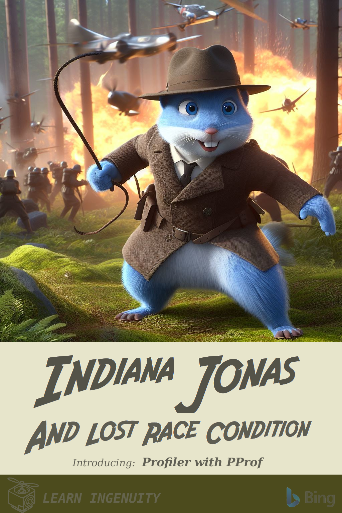

### :green_book: About:

This repository features memes in the form of posters for fictitious movies inspired by box office classics, with the majority featuring Gopher, the mascot of the Golang language, as the main character, along with other jokes involving various programming languages. It has a purely comedic nature with no aspirations of being the work of professional designers. AI was used extensively with minimal touch-ups and construction in Gimp .

These are satires and parodies with no commercial intent, created solely for creativity and future use in the educational project [CineCatalogo](https://github.com/jtonynet/cine-catalogo) microsservice part of [CineTicket Study](https://github.com/jtonynet/cine-ticket-study-microsservices). 

The prompts for generating the images, as well as font resources, can be found in their respective directories in the readme files when available.

 

 
<!-- ](./posters/pretty_gopher/README.md)  -->

 
<!-- ](./posters/spyder_gopher/README.md)  -->

<!-- img src="./posters/star_wars/poster.png" width="50%">(./posters/star_wars/README.md)  -->

 

 

 

 

 

<!-- 
https://www.klipartz.com/en/sticker-png-gikwo/download

https://br.freepik.com/fotos-gratis/ceu-estrelado_7061153.htm#query=ceu%20estrelado%20png&position=0&from_view=keyword&track=ais

https://www.dafont.com/the-amazing-spider-man.font
https://www.dafont.com/spider-font.font?fpp=100

https://www.dafont.com/star-jedi.font

https://www.dafont.com/pt/rio-black.font
-->
