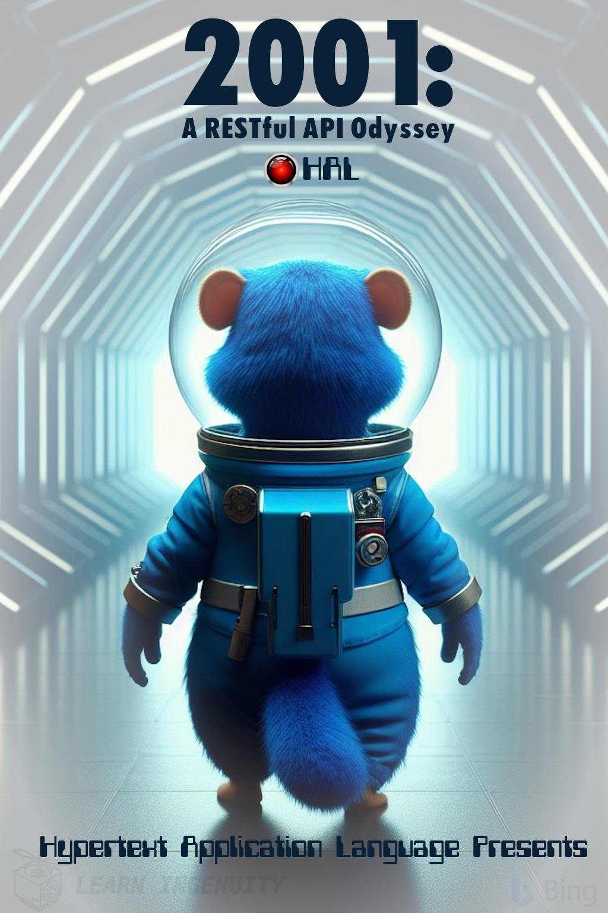

### :robot: Uso de IA:

Esse poster foi criado com o auxílio de [inteligência artificial](https://www.bing.com/images/) e um mínimo de 
retoque e construção no Gimp 

As fontes [OPTIFutura-ExtraBlackCond](https://www.whatfontis.com/FF_OPTIFutura-ExtraBlackCond.font) e [Computer Font](https://www.dafont.com/computerfont.font) foram utilizadas

<!-- https://www.dafont.com/computer-7.font -->

__Foram utilizados os seguintes prompts para sua criação no [Bing IA:](https://www.bing.com/images/create/)__

  
<b>"Gophers" </b>

<i>Gopher AZUL antropomorfico DE COSTAS PARA A "CAMERA" vestido de astronauta azul com capacete transparente caminhando DE COSTAS, EH IMPORTANTE QUE ELE ESTEJA DE COSTAS, EM UM amplo corredor hexagonal iluminado como se fosse o poster do filme 2001 uma odisseia no espaco supostamente feito pela pixar<b>(sic)</b></i>

