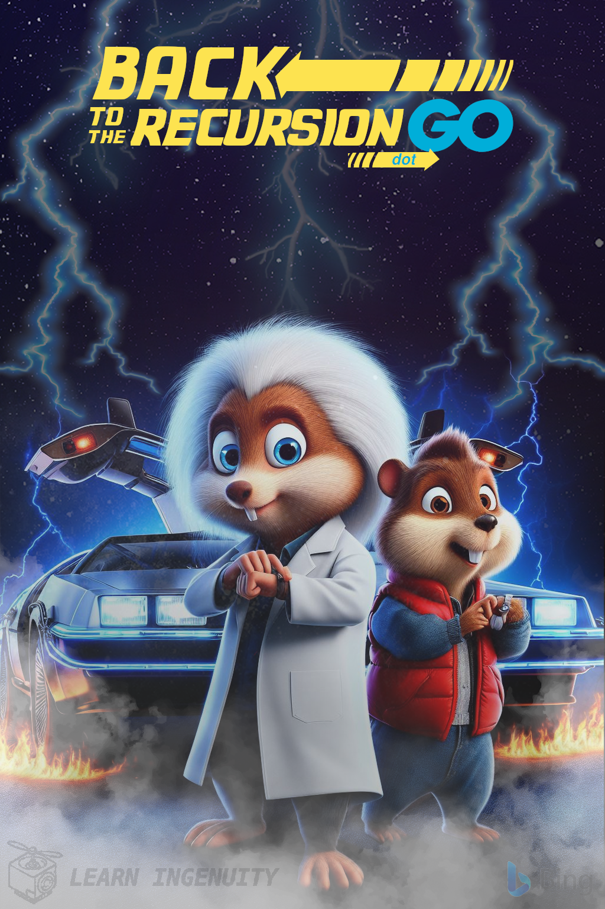

### :robot: Uso de IA:

Esse poster foi criado com o auxílio de [inteligência artificial](https://www.bing.com/images/) e um mínimo de 
retoque e construção no Gimp 

A fonte [Back to the Future 2002](https://www.dafont.com/back-to-the-future.font) foi utilizada

__Foram utilizados os seguintes prompts para sua criação no [Bing IA:](https://www.bing.com/images/create/)__

  
<b>"Marti e Doc" </b>

<i>"GOPHER azul com cabelos  de einstein e jaleco branco em frente a um carro delorean de portas abertas olhando PREOCUPADO seu relogio de pulso enquanto outro GOPHER jovial de jaqueta vermelha e cabelos castanhos parecido com micheal J fox olha PREOCUPADO no relogio de PULSO , poster de cinema,  RAIOS  EM VOLTA DO CARRO NA NOITE ESCURA APENAS OS DOIS PERSONAGENS E O CARRO NA CENA, lembrando poster de back to the future CARTOON 3D INSPIRADO PIXAR ACAO CINEMA"<b>(sic)</b></i>

