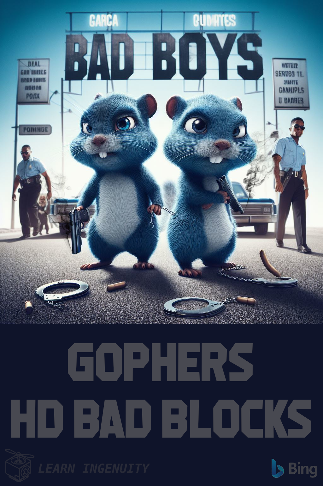

### :robot: Uso de IA:

Esse poster foi criado com o auxílio de [inteligência artificial](https://www.bing.com/images/) e um mínimo de 
retoque e construção no Gimp 

A fonte [Machine Gunk](https://www.dafont.com/machine-gunk.font) foi utilizada

__Foram utilizados os seguintes prompts para sua criação no [Bing IA:](https://www.bing.com/images/create/)__

  
<b>"Bad Boys" </b>

<i>"dois gophers AZUIS como se fossem os policiais do filme bad boys com armas em punho andando para frente da camera com uma gopher femea de algemas ao fundo fazeno referencia por similadridades ao poster de BAD BOYS estilo cartoon"<b>(sic)</b></i>

<!-- 
https://www.klipartz.com/en/sticker-png-gikwo/download

https://br.freepik.com/fotos-gratis/ceu-estrelado_7061153.htm#query=ceu%20estrelado%20png&position=0&from_view=keyword&track=ais

https://www.dafont.com/star-jedi.font
-->
