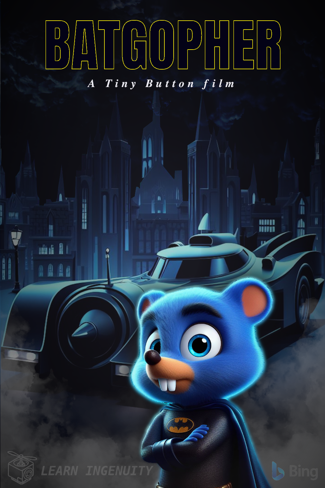

### :robot: Uso de IA:

Esse poster foi criado com o auxílio de [inteligência artificial](https://www.bing.com/images/) e um mínimo de 
retoque e construção no Gimp 

A fonte [Anton](https://www.fontbolt.com/font/batman-font/#google_vignette) foi utilizada

__Foram utilizados os seguintes prompts para sua criação no [Bing IA:](https://www.bing.com/images/create/)__

  
<b>"Batgopher" </b>

<i>"Gopher azul simbolo da linguagem golang com pelagem azul EXUBERANTE E  REALISTA ESTILO PIXAR 3D ANTROPOMORFICO (Proporçoes similares a humanas) VESTINDO UNIFORME DO BATMAN DO FILME DE 89 COM MASCARA DO BATMAN MAS AO INVES DE PONTIAGUDAS AS ORELHAS SAO REDONDAS E OLHOS BRANCOS EM POSE HEROICA, ATRAS DELE O BATMOVEL DO FILME DE 1989, poucos edificios  goticos em noite escura com fundo preto chapado estilo POSTER CARTOON REALISTA "<b>(sic)</b></i>

  
<b>"Batgopher-mobile" </b>

<i>"BATMOVEL DO FILME DE 1989 EM ESTILO PIXAR CARTOON 3D no CENTRO OCUPANDO 65% DA LARGURA DA IMAGEM ILUMINACAO EM TONS DE AZUL CLARO , edificios goticos em noite escura com FUNDO PRETO CHAPADO estilo POSTER CARTOON REALISTA COMO O POSTER DE BATMAN DO ANO 1989"<b>(sic)</b></i>

