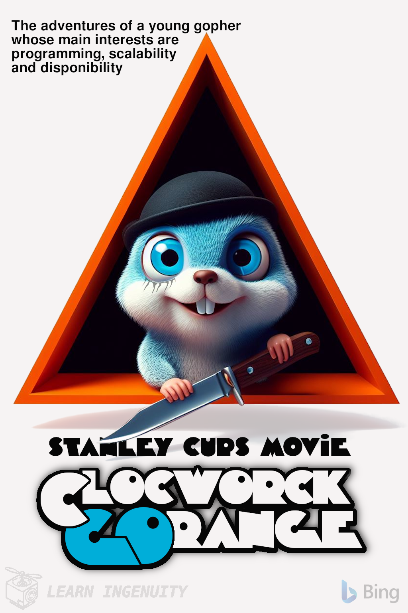

### :robot: Uso de IA:

Esse poster foi criado com o auxílio de [inteligência artificial](https://www.bing.com/images/) e um mínimo de 
retoque e construção no Gimp 

A fonte [Timepiece](https://hyperpix.net/fonts/a-clockwork-orange-font/) foi utilizada

__Foram utilizados os seguintes prompts para sua criação no [Bing IA:](https://www.bing.com/images/create/)__

  
<b>"Night Fever" </b>

<i>" Poster do filme "laranja mecanica" com Gopher azul  EM ESTILO PIXAR 3D saindo de um triangulo PRETO segurando um canivete atras do triangulo fundo branco chapado. PIXAR 3D ALTA QUALIDADE, POSTER FILME"<b>(sic)</b></i>

