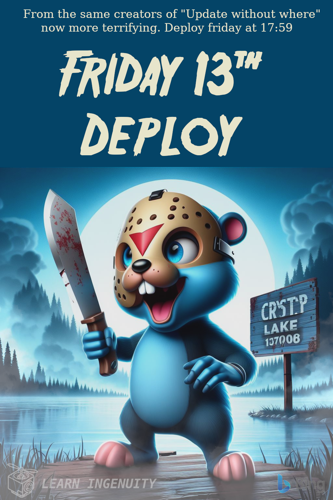

### :robot: Uso de IA:

Esse poster foi criado com o auxílio de [inteligência artificial](https://www.bing.com/images/) e um mínimo de 
retoque e construção no Gimp 

A fonte [Indiana Jonas](https://www.dafont.com/friday13.font) foi utilizada

__Foram utilizados os seguintes prompts para sua criação no [Bing IA:](https://www.bing.com/images/create/)__

  
<b>"Friday 13" </b>

<i>"Gopher azul com mascara de hoquei segurando um facao acima da cabeca de maneira assustadora como o personagem de sextafeira 13, ao fundo a placa do cristal lake e o lago com densa fumaca em estilo cartoon 3d realista estilizado"<b>(sic)</b></i>

