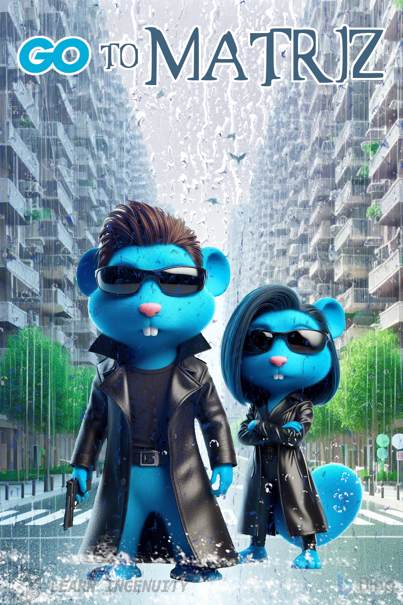

### :robot: Uso de IA:

Esse poster foi criado com o auxílio de [inteligência artificial](https://www.bing.com/images/) e um mínimo de 
retoque e construção no Gimp 

A fonte [matrix](https://www.dafont.com/pt/matrix.font) foi utilizada

__Foram utilizados os seguintes prompts para sua criação no [Bing IA:](https://www.bing.com/images/create/)__

  
<b>"Gophers" </b>

<i>"Gopher azul simbolo da linguagem golang, com sobretudo preto de couro e oculos escuros, armado de frente com aspecto antropomorfica QUE LEMBRE  NEO com cabelo caracteristico e do lado dele uma gopher azul femea que LEMBRE Carrie Anne Moss Tambem com o cabelo que lembre a atriz e de oculos escuros PARECENDO filme Matrix, Centralize os ocupando 40% da area da imgamem e de corpo inteiro. Em cartoon 3D realista SIMILAR filme da PIXAR"<b>(sic)</b></i>

  
<b>"Fundo" </b>

<i>"rua que ao fundo eh um beco sem saida, centralizada, ao estilo pixar 3d, chuva caindo, fundo branco, parecido com o poster de matrix"<b>(sic)</b></i>

