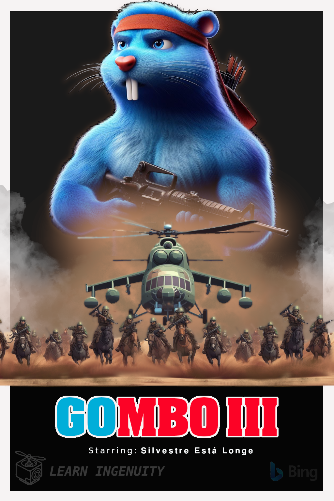

### :robot: Uso de IA:

Esse poster foi criado com o auxílio de [inteligência artificial](https://www.bing.com/images/) e um mínimo de 
retoque e construção no Gimp 

A fonte `Aachen BT Bold Condensed` foi utilizada

__Foram utilizados os seguintes prompts para sua criação no [Bing IA:](https://www.bing.com/images/create/)__

  
<b>"Gombo" </b>

<i>"Gopher azul simbolo da linguagem golang com pelagem azul EXUBERANTE E  REALISTA ESTILO PIXAR 3D ANTROPOMORFICO (Proporçoes similares a humanas mas musculoso como um fisiculturista de porte medio) com uma faixa vermelha na cabeca, cabelos que lembrem os do Silvester stalone EM  RAMBO, segurando uma metralhadora  e com um  arco e flecha preso em suas costas, OLHAR PENETRANTE E FIXO, POSE LATERAL DE CORPO INTEIRO FUNDO PRETO CHAPADO, poster do filme RAMBO 3 MAS EM ESTILO PIXAR"<b>(sic)</b></i>

  
<b>"Helicóptero e soldados" </b>

<i>"helecptero militar russo em estilo cartoon 3D de frente, centralizato na horizontal e no topo vertical enquanto na parte de baixo, no solo, cavaleiros soldados afegaos galopam levantando poeira em diracao a camera, cenario desertico cor marron chapado e ceu preto chapado. EM ESTILO CARTOON PIXAR 3D"<b>(sic)</b></i>

