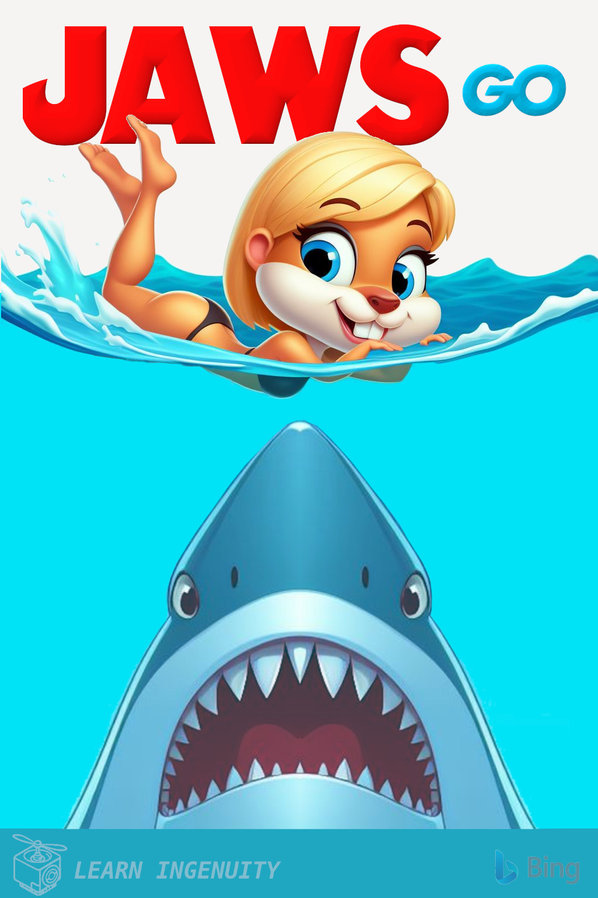

### :robot: Uso de IA:

Esse poster foi criado com o auxílio de [inteligência artificial](https://www.bing.com/images/) e um mínimo de 
retoque e construção no Gimp 

A fonte [Amity Jack](https://www.dafont.com/amity-jack.font?text=JAWS&psize=l) foi utilizada

__Foram utilizados os seguintes prompts para sua criação no [Bing IA:](https://www.bing.com/images/create/)__

  
<b>"Nadadora" </b>

<i>"gopher cartoon femea loira de nadando lateralmente no oceano com 70% da imagem sendo azul da cor do mar e os outros 30% branco chapado representando o ceu e na parte inferior do mar OUTRO gopher grande AZUL NA MESMA POSE DO POSTER DO FILME JAWS com os dois dentes frontais grandes afiados EM CG 3D PIXAR PARECIDO COM POSTER do filme JAWS "<b>(sic)</b></i>

