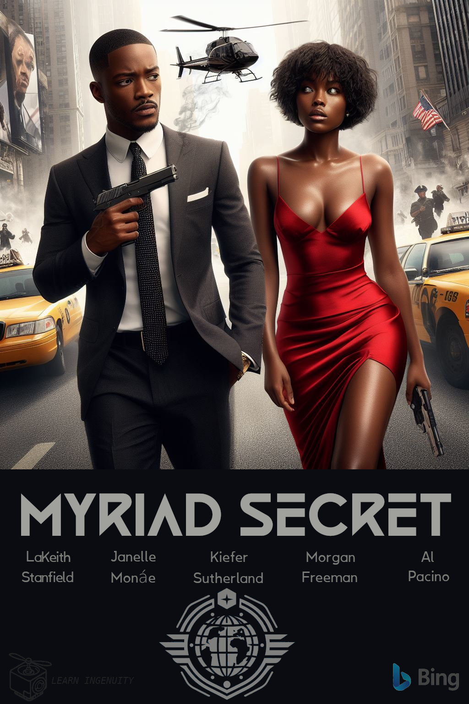

### :robot: Uso de IA:

Esse poster foi criado com o auxílio de inteligência artificial e um mínimo de 
retoque e construção no Gimp 

A fonte Black Future foi utilizada

__Foram utilizados os seguintes prompts para sua criação no [Bing IA:](https://www.bing.com/images/create/)__

  
<b>"Personagens" </b>

<i>"Personagem parecido com LaKeith Stanfield de cabelos curtos em terno chumbo bem cortado e elegante de corpo inteiro segurando uma pistola e andando para frente da camera ao lado porem um pouco mais ao fundo personagem parecida com Janele Monae em um vestido sexy vermelho olhando para o lado com expressao preocupada enquanto ao fundo taxis em uma rua movimentada de nova yorque enquanto helicopteros de policia sobrevoan a cena realista com uma aparencia de cartaz de filme de acao"<b>(sic)</b></i>

  
<b>"Logo do Globo" </b>

<i>"logo de agencia governamental cores chapadas branco e cinza um globo do mundo sem continentes e acima dele um losango com asas futuristas simplificadas em volta do globo"<b>(sic)</b></i>

