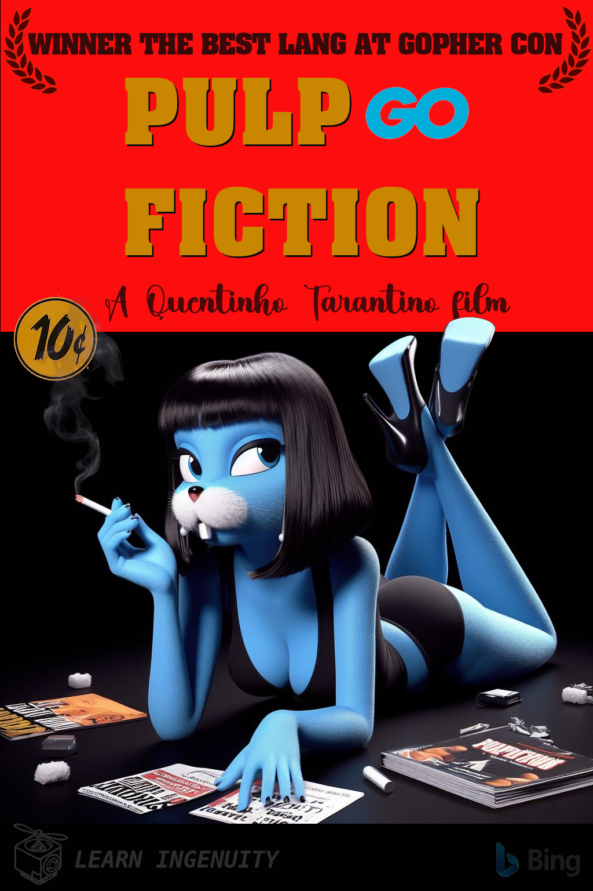

### :robot: Uso de IA:

Esse poster foi criado com o auxílio de [inteligência artificial](https://www.bing.com/images/) e um mínimo de 
retoque e construção no Gimp 

As fontes `Aachen BT Bold Condensed` e `Handle` foram utilizadas

__Foram utilizados os seguintes prompts para sua criação no [Bing IA:](https://www.bing.com/images/create/)__

  
<b>"Poster" </b>

<i>"Gopher Azul simbolo da linguagem golang, feminina mas mantendo formas de cartoon como loney tunes e orelhas caracteristicas de gopher furry, bonita morena de cabelos curtos, deitada fumando cigarro e com revistas no chao e uma arma prateada proxima ao braco, EXATAMENTE COMO NO POSTER DO FILME PULP FICTION mas em cartoon, cores chapadas FUNDO PRETO, CENTRALIZAR PARA QUE NAO EXISTAM CORTES, ESTILO 3D PIXAR"<b>(sic)</b></i>

