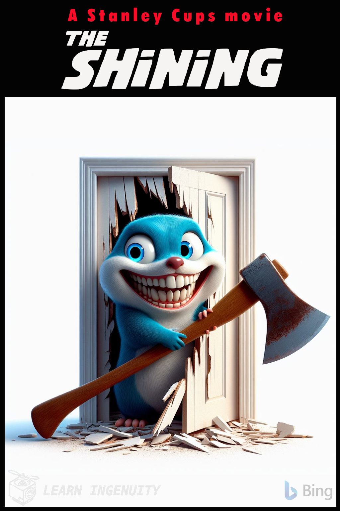

### :robot: Uso de IA:

Esse poster foi criado com o auxílio de [inteligência artificial](https://www.bing.com/images/) e um mínimo de 
retoque e construção no Gimp 

A fonte [Shining NFI Demo Font](https://fontmeme.com/fonts/shining-nfi-demo-font/) foi utilizada

__Foram utilizados os seguintes prompts para sua criação no [Bing IA:](https://www.bing.com/images/create/)__

  
<b>"Gophers" </b>

<i>"gopher AZUL antropomorfico com sorriso macabro com apenas o rosto sendo visivel atraves das partes quebradas de uma porta branca junto ao machado que ele usou para quebrar a porta, ASSIM COMO NO POSTER DO FILME O ILUMINADO mas em estilo cartoon 3d pixar, fundo branco chapado"<b>(sic)</b></i>

